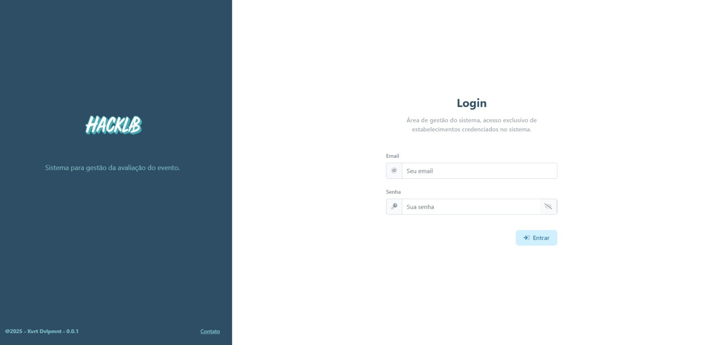
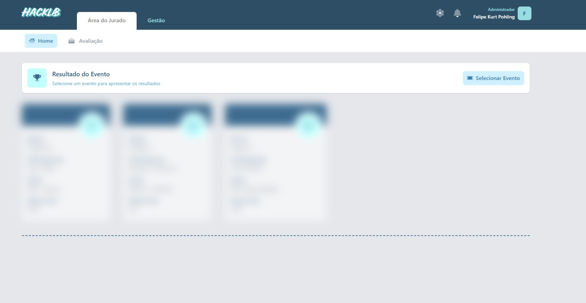
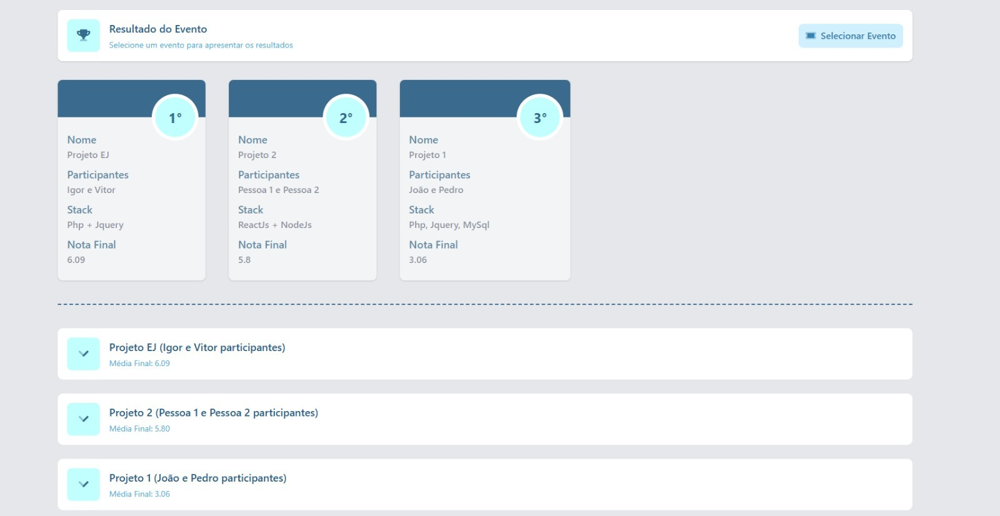
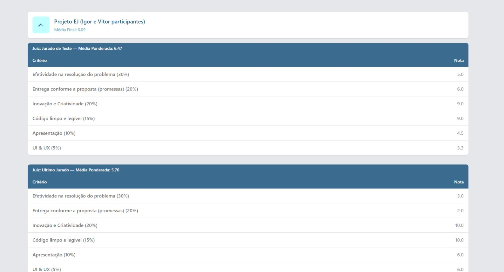
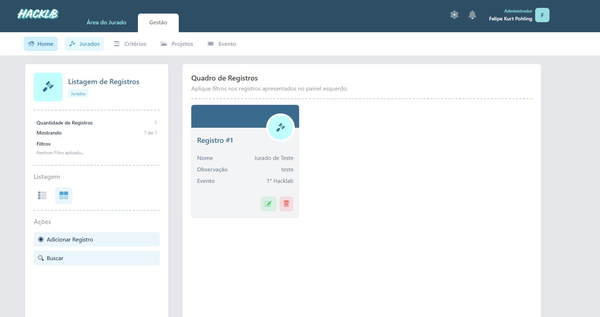
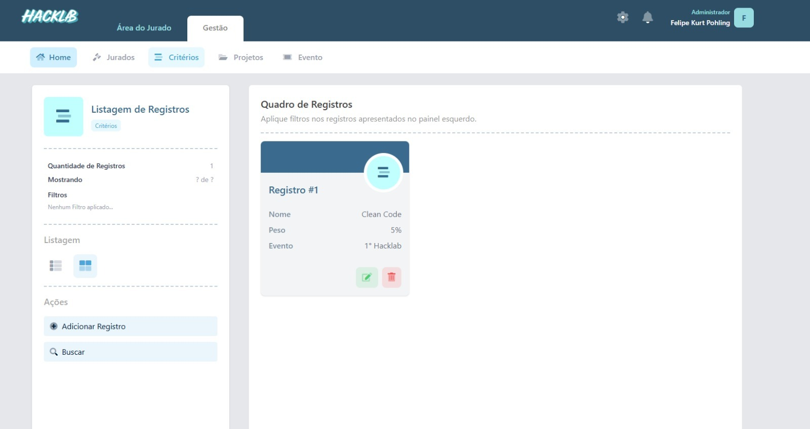
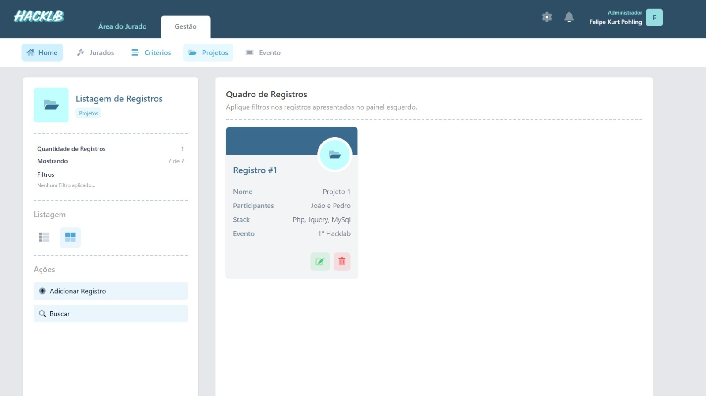
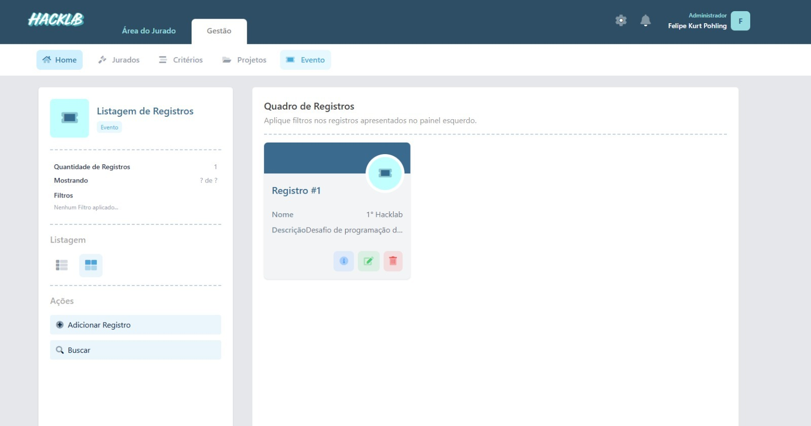

# votacao_hacklab 🚀

Sistema de votação de projetos para eventos de programação, construído como um caso de uso do **LaravelCMS**. Permite gerenciar jurados, critérios de avaliação, registrar votos e divulgar os vencedores de forma simples e ágil.

---

## 🎯 Objetivo

- Facilitar a organização de competições de projetos em hackathons ou eventos de programação.
- Controlar o cadastro de jurados e critérios de avaliação.
- Oferecer interface para jurados registrarem seus votos de forma dinâmica.
- Disponibilizar área de divulgação dos resultados e vencedores.

## ✨ Principais Recursos

- **CRUD Automático** de entidades (jurados, critérios, projetos e avaliações) via arquivos `.yaml`.
- **Controle de Permissões**: administradores definem regras e divulgam resultados; jurados podem registrar votos.
- **Interface de Votação**: ambiente dedicado para jurados preencherem notas e comentários.
- **Painel de Resultados**: área pública/privada para anunciar vencedores e mostrar classificação final.
- **Flexibilidade** para personalizar views caso precise de layout específico.
- **Crônometro** crônometro compartilhado entre todos os users de um certo evento para sincronizar o tempo restante para desafios.

## 📦 Tecnologias

- **Laravel 11.x**
- **LaravelCMS** (template para CRUD dinâmico via YAML, construido usando a TALL Stack)
- **Tailwind CSS** (estilização)
- **YAML** (configuração de entidades)

## ⚙️ Permissões e Perfis

- **Administrador**: gerencia CRUDs de todas as entidades e divulga resultados.
- **Jurado**: acessa apenas a área de votação e registra votos.
- Possibilidade de múltiplos usuários em cada perfil.

## 🖼️ Screenshots

<!-- Adicione prints relevantes do sistema aqui -->

<!-- Telas Genéricas -->

2025 @ Kvrt Dvlpmnt
